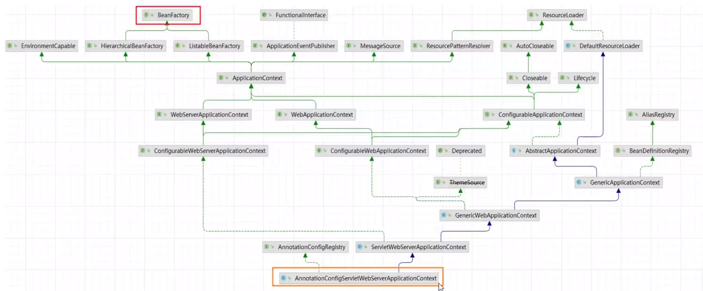

## 面试大纲

前置知识

1. ApplicationContextInitializer
2. ApplicationListener
3. BeanFactory
4. BeanDefinition
5. BeanFactoryPostProcessor
6. Aware
7. InitializingBean/DisposableBean
8. BeanPostProcessor


面试题

1. SpringBoot 启动流程
2. IOC 容器初始化流程
3. Bean 生命周期
4. Bean 循环依赖
5. SpringMvc 执行流程


## 前置知识

### ApplicationContextInitializer

SpringBoot 框架在设计之初，为了有更好的兼容性，在不同的运行阶段，提供了非常多的扩展点，可以让开发者根据自己的需求，在整个 Spring 应用程序运行过程中执行自定义的代码

- IOC 容器对象创建完成后执行，可以对上下文环境做一些操作，例如运行环境属性注册等

使用

1. 自定义类，实现 ApplicationContextInitializer 接口

   ```java
   public class MyApplicationContextInitializer implements ApplicationContextInitializer {
   
       // ioc 容器对象创建完毕后执行
       @Override
       public void initialize(ConfigurableApplicationContext applicationContext) {
           // 给上下文 context 对象注入环境属性
           // 1.准备属性
           Map<String, Object> myMap = new HashMap<>();
           myMap.put("applicationName", "big-event");
           
           // 2.获取一个属性资源管理对象
           // 获取的环境对象
           ConfigurableEnvironment environment = applicationContext.getEnvironment();
           // 属性资源管理对象
           MutablePropertySources propertySources = environment.getPropertySources();
   
           // 3.注册
           propertySources.addLast(new MapPropertySource("myMap", myMap));
       }
   }
   ```

2. 在 META-INF/spring.factories 配置文件中配置自定义的类

   在 idea 中可以使用 `Ctrl + Alt + 空格` 快捷键补全路径

   ```sh
   # 接口全路径名称等于自定义类的全路径名称  Ctrl + Alt + 空格 快捷键提示
   org.springframework.context.ApplicationContextInitializer=com.entropy.initializer.MyApplicationContextInitializer
   ```

   测试是否能够在上下文中获取到信息

   ```java
   @SpringBootApplication
   public class App {
       public static void main(String[] args) {
           ConfigurableApplicationContext context = SpringApplication.run(App.class, args);
           String applicationName = context.getEnvironment().getProperty("applicationName");
           System.out.println(applicationName);
       }
   }
   ```

#### 小结

1. ApplicaionContextInitializer 如何使用
   - 自定义类，实现 ApplicationContextInitializer 接口
   - 在 META-INF/spring.factories 配置文件中配置自定义的类
2. initialize 方法什么时候执行
   - IOC 容器对象创建完成后执行，常用于环境属性注册


### ApplicationListener

- 监听容器发布的事件，允许程序员执行自己的代码，完成事件驱动开发，它可以监听容器初始化完成、初始化失败等事件。通常情况下可以使用监听器加载资源，开启定时任务等。

使用

1. 自定义类，实现 ApplicationListener 接口

   ```java
   public class MyListener implements ApplicationListener {
       @Override
       public void onApplicationEvent(ApplicationEvent event) {
           // ApplicationEvent event 对应的就是发布的事件，ApplicationReadyEvent/ApplicationFailedEvent
           if (event instanceof ApplicationReadyEvent) {
               // 容器初始化成功
               System.out.println("MyListener...容器初始化成功");
           }
   
           if (event instanceof ApplicationFailedEvent) {
               // 容器初始化失败
               System.out.println("MyListener...容器初始化失败");
           }
       }
   }
   ```

2. 在 META-INF/spring.factories 配置文件中配置自定义的类

   ```sh
   org.springframework.context.ApplicationListener=com.entropy.listener.MyListener
   ```

   启动项目观察输出

   > 模拟初始化失败的情况，可以在前面的 MyApplicationInitializer 类中使用 `throw new RuntimeException();` 手动抛出异常。

#### 小结

1. ApplicationListener 如何使用
   - 自定义类，实现 ApplicationListener 接口
   - 在 META-INF/spring.factories 配置文件中配置自定义的类
2. onApplicationEvent 方法什么时候执行
   - IOC 容器发布事件之后执行，通常用于资源加载，定时任务发布等


### BeanFactory

- Bean 容器的根接口，提供对 Bean 对象的创建、配置、依赖注入等功能
- AnnotationConfigServletWebServerApplicationContext ——> DefaultListableBeanFactory



可以对以下代码的 `getBean` 方法断点跟踪调试，查看执行流程

```java
@SpringBootApplication
public class App {
    public static void main(String[] args) {
        ConfigurableApplicationContext context = SpringApplication.run(App.class, args);

        // AnnotationConfigServletWebServerApplicationContext 最终获取到的容器类型
        System.out.println(context.getClass());
        App app = context.getBean(App.class);
        System.out.println(app);
    }
}
```

#### 小结

1. BeanFactory 的作用
   - Bean 容器的根接口，提供 Bean 对象的创建、配置、依赖注入等功能
2. BeanFactory 常见的两个实现
   - AnnotationConfigServletWebServerApplicationContext
   - DefaultListableBeanFactory


### BeanDefinition

- 用于描述 Bean，包括 Bean 的名称、属性、行为，实现的接口，添加的注解等等，Spring 中，Bean 在创建之前，都需要封装成对应的 BeanDefinition，然后根据 BeanDefinition 进一步创建 Bean 对象


> 其中的 ScannedGenericBeanDefinition 就是对 @Component、@Controller、@Service、@Repository、@Configuration 的封装。
>
> ConfigurationClassBeanDefinition 则是用于描述通过 @Bean 注解注入到 IOC 容器的实例。

创建以下两个类用于模拟不同的注入

```java
@Component // Bean 对应的信息封装到 ScannedGenericBeanDefinition
public class User {
}
```

```java
@Configuration
public class MyConfig {

    @Bean // 由 ConfigurationClassBeanDefinition 描述
    public String foo() {
        return "foo";
    }
}
```

在主启动类通过以下代码测试输出

```java
@SpringBootApplication
public class App {
    public static void main(String[] args) {
        ConfigurableApplicationContext context = SpringApplication.run(App.class, args);

        // 获取 BeanDefinition 对象
        ConfigurableListableBeanFactory beanFactory = context.getBeanFactory();
        BeanDefinition userBD = beanFactory.getBeanDefinition("user");
        BeanDefinition fooBD = beanFactory.getBeanDefinition("foo");
        System.out.println(userBD.getClass());
        System.out.println(fooBD.getClass());
    }
}
```


### BeanFactoryPostProcessor

- Bean 工厂后置处理器，当 BeanFactory 准备好了后 ( Bean 初始化之前)，会调用该接口的 postProcessBeanFactory 方法，经常用于新增 BeanDefinition

创建一个 Teacher 类，该类不使用任何注解

```java
public class Teacher {
}
```

创建 MyBeanFactoryPostProcessor 类，将 Teacher 封装为 BeanDefinition

```java
@Component
public class MyBeanFactoryPostProcessor implements BeanFactoryPostProcessor {
    // 当 BeanFactory 被实例化之后 (Bean 创建之前), 回调此函数, 注册一些 BeanDefinition
    @Override
    public void postProcessBeanFactory(ConfigurableListableBeanFactory beanFactory) throws BeansException {
        // 注册一个 Teacher 的 BeanDefinition
        GenericBeanDefinition gBD = new GenericBeanDefinition();
        gBD.setBeanClass(Teacher.class);

        // 向下强转
        DefaultListableBeanFactory dBF = (DefaultListableBeanFactory) beanFactory;
        dBF.registerBeanDefinition("teacher", gBD);
    }
}
```

在主启动类中输出 Teacher 的 Bean 实例

```java
@SpringBootApplication
public class App {
    public static void main(String[] args) {
        ConfigurableApplicationContext context = SpringApplication.run(App.class, args);

        System.out.println(context.getBean("teacher"));
    }
}
```


|                 实现类名                  |                    作用                    |
| :---------------------------------------: | :----------------------------------------: |
|      ConfigurationClassPostProcessor      |          扫描启动类所在包下的注解          |
| ServletComponentRegisteringPostProcessor  | 扫描 @WebServlet、@WebFilter、@WebListener |
| CachingMetadataReaderFactoryPostProcessor |    配置 ConfigurationClassPostProcessor    |
|    ConfigurationWarningsPostProcessor     |                配置警告提示                |


### Aware

- 感知接口，Spring 提供的一种机制，通过实现该接口，重写方法，可以感知 Spring 应用程序执行过程中的一些变化。Spring 会判断当前的 Bean 有没有实现 Aware 接口，如果实现了，会在特定的时机回调接口对应的方法

  |       子接口名       |          作用           |
  | :------------------: | :---------------------: |
  |    BeanNameAware     |   Bean 名称的感知接口   |
  | BeanClassLoaderAware | Bean 类加载器的感知接口 |
  |   BeanFactoryAware   |   Bean 工厂的感知接口   |

  编写一个类实现对应的接口

  ```java
  @Component
  public class Student implements BeanNameAware, BeanClassLoaderAware, BeanFactoryAware {
      // BeanClassLoaderAware 的回调方法
      @Override
      public void setBeanClassLoader(ClassLoader classLoader) {
          System.out.println("Student...setBeanClassLoader..." + classLoader);
      }
  
      // BeanFactoryAware 的回调方法
      @Override
      public void setBeanFactory(BeanFactory beanFactory) throws BeansException {
          System.out.println("Student...setBeanFactory..." + beanFactory);
      }
  
      // BeanNameAware 的回调方法
      @Override
      public void setBeanName(String name) {
          System.out.println("Student...setBeanName..." + name);
      }
  }
  ```

  启动项目观察输出


### InitializingBean/DisposableBean

- 初始化接口，当 Bean 被实例化好后，会回调里面的函数，经常用于一些加载资源的工作
- 销毁接口，当 Bean 被销毁之前，会回调里面的函数，经常用于做一些释放资源的工作

编写一个类实现对应的接口

```java
@Component
public class Animal implements InitializingBean, DisposableBean {
    // PostConstructor, PreDestroy 这两个注解提供初始化方法和销毁方法
    @PostConstruct
    public void initMethod() {
        System.out.println("Animal...PostConstruct...initMethod...");
    }
    @PreDestroy
    public void deleteMethod() {
        System.out.println("Animal...PreDestroy...deleteMethod...");
    }

    // 销毁方法
    @Override
    public void destroy() throws Exception {
        System.out.println("Animal...destroy...");
    }

    // 初始化方法
    @Override
    public void afterPropertiesSet() throws Exception {
        System.out.println("Animal...afterPropertiesSet...");
    }
}
```

启动项目测试初始化方法，关闭项目测试销毁方法


### BeanPostProcessor

- Bean 的后置处理器，在 Bean 对象初始化之前以及初始化之后，会回调该接口对应的方法

  - postProcessBeforeInitialization：Bean 对象初始化之前调用
  - postProcessAfterInitialization：Bean 对象初始化之后调用

  编写一个类实现对应的接口

  ```java
  @Component
  public class MyBeanPostProcessor implements BeanPostProcessor {
      // 初始化之前调用
      @Override
      public Object postProcessBeforeInitialization(Object bean, String beanName) throws BeansException {
          System.out.println("MyBeanPostProcessor...postProcessBeforeInitialization..." + beanName);
          return BeanPostProcessor.super.postProcessBeforeInitialization(bean, beanName);
      }
  
      // 初始化之后调用
      @Override
      public Object postProcessAfterInitialization(Object bean, String beanName) throws BeansException {
          System.out.println("MyBeanPostProcessor...postProcessAfterInitialization..." + beanName);
          return BeanPostProcessor.super.postProcessAfterInitialization(bean, beanName);
      }
  }
  ```

  启动项目观察输出

  |               实现类名               |                作用                 |
  | :----------------------------------: | :---------------------------------: |
  | AutowiredAnnotationBeanPostProcessor |          用来完成依赖注入           |
  |       AbstractAutoProxyCreator       |       用来完成代理对象的创建        |
  |  AbstractAdvisingBeanPostProcessor   | 将 Aop 中的通知作用于特定的 Bean 上 |


## 面试题

### SpringBoot 启动流程

#### 过程概述

- new SpringApplication()
  1. 确认 web 应用的类型
  2. 加载 ApplicationContextInitializer
  3. 加载 ApplicationListener
  4. 记录主启动类
- run()
  1. 准备环境对象 Environment，用于加载系统属性等等
  2. 打印 Banner
  3. 实例化容器 Context
  4. 准备容器，为容器设置 Environment、BeanFactoryPostProcessor，并加载主类对应的 BeanDefinition
  5. 刷新容器 (创建 Bean 实例)
  6. 返回容器

#### 源码解析

使用 debug 的方式查看源码执行流程

在 debug 过程中关注 SpringApplication.java 中的两段代码

```java
public SpringApplication(ResourceLoader resourceLoader, Class<?>... primarySources) {
    this.resourceLoader = resourceLoader;
    Assert.notNull(primarySources, "PrimarySources must not be null");
    this.primarySources = new LinkedHashSet<>(Arrays.asList(primarySources));
    // 确定 web 应用的类型
    this.webApplicationType = WebApplicationType.deduceFromClasspath();
    this.bootstrapRegistryInitializers = new ArrayList<>(
        getSpringFactoriesInstances(BootstrapRegistryInitializer.class));
    // 加载 ApplicationContextInitializer
    setInitializers((Collection) getSpringFactoriesInstances(ApplicationContextInitializer.class));
    // 加载 ApplicationListener
    setListeners((Collection) getSpringFactoriesInstances(ApplicationListener.class));
    // 确定主启动类
    this.mainApplicationClass = deduceMainApplicationClass();
}
```


另外一段代码，主要关注 try 代码块里的内容

```java
public ConfigurableApplicationContext run(String... args) {
    Startup startup = Startup.create();
    if (this.registerShutdownHook) {
        SpringApplication.shutdownHook.enableShutdownHookAddition();
    }
    DefaultBootstrapContext bootstrapContext = createBootstrapContext();
    ConfigurableApplicationContext context = null;
    configureHeadlessProperty();
    SpringApplicationRunListeners listeners = getRunListeners(args);
    listeners.starting(bootstrapContext, this.mainApplicationClass);
    
    try {
        ApplicationArguments applicationArguments = new DefaultApplicationArguments(args);
        // 准备 Environment 对象
        ConfigurableEnvironment environment = prepareEnvironment(listeners, bootstrapContext, applicationArguments);
        // 打印 Banner
        Banner printedBanner = printBanner(environment);
        // 实例化 IOC 容器
        context = createApplicationContext();
        context.setApplicationStartup(this.applicationStartup);
        // 准备容器，为容器设置 Environment、BeanFactoryPostProcessro，并加载主启动类对应的 BeanDefinition
        prepareContext(bootstrapContext, context, environment, listeners, applicationArguments, printedBanner);
        // 刷新容器，创建 Bean 实例
        refreshContext(context);
        afterRefresh(context, applicationArguments);
        startup.started();
        if (this.logStartupInfo) {
            new StartupInfoLogger(this.mainApplicationClass).logStarted(getApplicationLog(), startup);
        }
        // 调用监听器
        listeners.started(context, startup.timeTakenToStarted());
        callRunners(context, applicationArguments);
    }
    catch (Throwable ex) {
        throw handleRunFailure(context, ex, listeners);
    }
    try {
        if (context.isRunning()) {
            listeners.ready(context, startup.ready());
        }
    }
    catch (Throwable ex) {
        throw handleRunFailure(context, ex, null);
    }
    // 返回容器
    return context;
}
```


#### 答案提取

Q：请聊一聊 SpringBoot 的启动流程？

A：

总：SpringBoot 启动，其本质就是加载各种配置信息，然后初始化 IOC 容器并返回

分：在其启动的过程中会做这么几个事情

​	首先，当我们在启动类执行 SpringApplication.run 这行代码的时候，在它的方法内部其实会做两个事情

​		1.创建 SpringApplication 对象;

​		2.执行 run 方法。

​	其次，在创建 SpringApplication 对象的时候，在它的构造方法内部主要做 3 个事情。

​		1.确认 web 应用类型，一般情况下是 servlet 类型，这种类型的应用，将来会自动启动一个 tomcat

​		2.从 spring.factories 配置文件中，加载默认的 ApplicationContextInitializer 和 ApplicationListener

​		3.记录当前应用的主启动类，将来做包扫描使用

​	最后，对象创建好了以后，再调用该对象的 run 方法，在 run 方法内部主要做 4 个事情

​		1.准备 Environment 对象，它里面会封装一些当前应用运行环境的参数，比如环境变量等等

​		2.实例化容器，这里仅仅只是创建 ApplicationContext 对象

​		3.容器创建好了以后，会为容器做一些准备工作，比如为容器设置 Environment、BeanFactoryPostProcessor 后置处理器，并且加载主类对应的 Definition

​		4.刷新容器，就是我们常说的 refresh，在这里会真正地创建 Bean 实例

总：总结一下我刚说的，其实 SpringBoot 启动的时候核心就两步，创建 SpringApplication 对象以及 run 方法的调用，在 run 方法中会真正地实例化容器，并创建容器中需要的 Bean 实例，最终返回


### IOC 容器初始化流程

#### 过程概述

- AbstractApplicationContext.refresh()

  1. 准备 BeanFactory(DefaultListableBeanFactory)

     设置 ClassLoader

     设置 Environment

  2. 扫描要放入容器中的 Bean，得到对应的 BeanDefinition (只扫描，并不创建)

  3. 注册 BeanPostProcessor

  4. 处理国际化

  5. 初始化事件多播器 ApplicationEventMulticaster

  6. 启动 tomcat

  7. 绑定事件监听器和事件多播器

  8. 实例化非懒加载的单例 Bean

  9. 扫尾工作，比如清空实例化时占用的缓存等

#### 源码解析

在前面遇到的 `refreshContext(context)` 方法处断点跟踪调试，查看执行流程

SpringApplication.java

```java
private void refreshContext(ConfigurableApplicationContext context) {
    if (this.registerShutdownHook) {
        shutdownHook.registerApplicationContext(context);
    }
    refresh(context);
}
```

```java
protected void refresh(ConfigurableApplicationContext applicationContext) {
    applicationContext.refresh();
}
```

之后会调用 ServletWebServerApplicationContext.java 中的 refresh 方法

```java
public final void refresh() throws BeansException, IllegalStateException {
    try {
        super.refresh();
    }
    catch (RuntimeException ex) {
        WebServer webServer = this.webServer;
        if (webServer != null) {
            webServer.stop();
            webServer.destroy();
        }
        throw ex;
    }
}
```

这个 refresh 又会调用父类 AbstractApplicationContext 的 refresh 方法

```java
public void refresh() throws BeansException, IllegalStateException {
    this.startupShutdownLock.lock();
    try {
        this.startupShutdownThread = Thread.currentThread();

        StartupStep contextRefresh = this.applicationStartup.start("spring.context.refresh");

        // Prepare this context for refreshing.
        prepareRefresh();

        // 获取委托的 beanFactory
        ConfigurableListableBeanFactory beanFactory = obtainFreshBeanFactory();

        // 为 beanFactory 设置一些属性，比如类加载器，同时注入初始的 Bean 实例，例如 Environment 等
        prepareBeanFactory(beanFactory);

        try {
            // Allows post-processing of the bean factory in context subclasses.
            postProcessBeanFactory(beanFactory);

            StartupStep beanPostProcess = this.applicationStartup.start("spring.context.beans.post-process");
            // 执行 BeanFactory 后置处理器，这里会扫描所有要注册的 Bean，但并不创建
            invokeBeanFactoryPostProcessors(beanFactory);
            // 注册 Bean 后置处理器
            registerBeanPostProcessors(beanFactory);
            beanPostProcess.end();

            // 处理国际化
            initMessageSource();

            // 初始化事件多播器
            initApplicationEventMulticaster();

            // 初始化特殊的 Bean，这里会启动 tomcat
            onRefresh();

            // 注册监听器
            registerListeners();

            // 实例化 Bean
            finishBeanFactoryInitialization(beanFactory);

            // 发布结束的刷新事件
            finishRefresh();
        }

        catch (RuntimeException | Error ex ) {
            if (logger.isWarnEnabled()) {
                logger.warn("Exception encountered during context initialization - " +
                            "cancelling refresh attempt: " + ex);
            }

            // Destroy already created singletons to avoid dangling resources.
            destroyBeans();

            // Reset 'active' flag.
            cancelRefresh(ex);

            // Propagate exception to caller.
            throw ex;
        }

        finally {
            contextRefresh.end();
        }
    }
    finally {
        this.startupShutdownThread = null;
        this.startupShutdownLock.unlock();
    }
}
```


#### 答案提取

Q：请聊一聊 IOC 容器的初始化流程？

A：

总：IOC 容器的初始化，核心工作是在 AbstractApplicationContext.refresh 方法中完成的

分：在 refresh 方法中主要做了这几件事

​	1.准备 BeanFactory，在这一块需要给 BeanFactory 设置很多属性，  比如类加载器、Environment 等

​	2.执行 BeanFactory 后置处理器，这一阶段会扫描要放入到容器中的 Bean 信息，得到对应的 BeanDefinition (注意，这里只扫描，不创建)

​	3.注册 BeanPostProcessor，我们自定义的 BeanPostProcessor 就是在这一个阶段被加载的，将来 Bean 对象实例化好后需要用到

​	4.启动 tomcat

​	5.实例化容器中分懒加载的单例 Bean，这里需要注意的是，多例 Bean 和懒加载的 Bean 不会在这个阶段实例化，将来用到的时候再创建

​	6.当容器初始化完毕后，再做一些扫尾工作，比如清除缓存等

总：简单总结一下，在 IOC 容器初始化的过程中，首先得准备并执行 BeanFactory 后置处理器，其次得注册 Bean 后置处理器，并启动 tomcat，最后需要借助于 BeanFactory 完成 Bean 的实例化


### Bean 生命周期

#### 过程概述

- 创建对象
  - 实例化 (构造方法)
  - 依赖注入
- 初始化
  - 执行 Aware 接口回调
  - 执行 BeanPostProcessor.postProcessBeforeInitialization
  - 执行 InitializingBean 回调 (优先执行 @PostConstruct)
  - 执行 BeanPostProcessor.postProcessAfterInitialization
- 使用对象
- 销毁对象
  - 执行 DisposableBean 回调 (优先执行 @PreDestory)

创建对象和初始化都是在 AbstractAutowireCapableBeanFactory.doCreateBean() 方法中实现

#### 源码解析

创建两个类用于测试 Bean 的实例化和依赖注入

```java
@Component
public class Father implements InitializingBean, DisposableBean {

    @Autowired
    private Son son;

    @PostConstruct
    public void initMethod() {
        System.out.println("Father...initMethod...");
    }

    @PreDestroy
    public void destroyMethod() {
        System.out.println("Father...destroyMethod...");
    }

    @Override
    public void afterPropertiesSet() throws Exception {
        System.out.println("InitializingBean...afterPropertiesSet...执行了");
    }

    @Override
    public void destroy() throws Exception {
        System.out.println("DisposableBean...destroy...执行了");
    }
}
```

```java
@Component
public class Son {
}
```


关注 AbstractApplicationContext.java 中的 `finishBeanFactoryInitialization(beanFactory)` 方法，在此处进行断点调试

```java
public void refresh() throws BeansException, IllegalStateException {
    // ....
    // 实例化 Bean
    finishBeanFactoryInitialization(beanFactory);
    // ....
}
```

```java
protected void finishBeanFactoryInitialization(ConfigurableListableBeanFactory beanFactory) {
    // ....
    // Instantiate all remaining (non-lazy-init) singletons.
    beanFactory.preInstantiateSingletons();
}
```

DefaultListableBeanFactory

```java
public void preInstantiateSingletons() throws BeansException {
    List<String> beanNames = new ArrayList<>(this.beanDefinitionNames);
    // 实例化
    for (String beanName : beanNames) {
        RootBeanDefinition bd = getMergedLocalBeanDefinition(beanName);
        if (!bd.isAbstract() && bd.isSingleton() && !bd.isLazyInit()) {
            if (isFactoryBean(beanName)) {
                Object bean = getBean(FACTORY_BEAN_PREFIX + beanName);
                if (bean instanceof SmartFactoryBean<?> smartFactoryBean && smartFactoryBean.isEagerInit()) {
                    getBean(beanName);
                }
            }
            else {
                getBean(beanName);
            }
        }
    }
    // ....
}
```

AbstractBeanFactory

```java
public Object getBean(String name) throws BeansException {
    return doGetBean(name, null, null, false);
}
```

```java
protected <T> T doGetBean(
    String name, @Nullable Class<T> requiredType, @Nullable Object[] args, boolean typeCheckOnly)
    throws BeansException {
    // ....
    sharedInstance = getSingleton(beanName, () -> {
        try {
            return createBean(beanName, mbd, args);
        }
        catch (BeansException ex) {
            // ....
        }
    });
    // ....
}
```

DefaultSingletonBeanRegistry

```java
public Object getSingleton(String beanName, ObjectFactory<?> singletonFactory) {
    // ....
    singletonObject = singletonFactory.getObject();
    // ....
}
```

AbstractAutowireCapableBeanFactory

```java
protected Object createBean(String beanName, RootBeanDefinition mbd, @Nullable Object[] args)
    throws BeanCreationException {
    // ....
    Object beanInstance = doCreateBean(beanName, mbdToUse, args);
    // ....
}
```

Bean 的实例化是在 AbstractAutowireCapableBeanFactory 的 `createBeanInstance` 方法中完成的，其底层是通过反射实现的

```java
protected Object doCreateBean(String beanName, RootBeanDefinition mbd, @Nullable Object[] args)
    throws BeanCreationException {
    // Instantiate the bean.
    BeanWrapper instanceWrapper = null;
    if (mbd.isSingleton()) {
        instanceWrapper = this.factoryBeanInstanceCache.remove(beanName);
    }
    if (instanceWrapper == null) {
        // 实例化 Bean
        instanceWrapper = createBeanInstance(beanName, mbd, args);
    }
    Object bean = instanceWrapper.getWrappedInstance();
    Class<?> beanType = instanceWrapper.getWrappedClass();
    if (beanType != NullBean.class) {
        mbd.resolvedTargetType = beanType;
    }
    // ....
}
```

然后是 @Autowire 的依赖注入，同样是在 AbstractAutowireCapableBeanFactory 中完成的，具体是通过 `populateBean` 方法实现，对象的初始化也在后面的 `initializeBean` 中实现。

```java
protected Object doCreateBean(String beanName, RootBeanDefinition mbd, @Nullable Object[] args)
    throws BeanCreationException {
    // ....
    // Initialize the bean instance.
    Object exposedObject = bean;
    try {
        // 填充 Bean，完成依赖注入
        populateBean(beanName, mbd, instanceWrapper);
        // 执行初始化
        exposedObject = initializeBean(beanName, exposedObject, mbd);
    }
    catch (Throwable ex) {
        if (ex instanceof BeanCreationException bce && beanName.equals(bce.getBeanName())) {
            throw bce;
        }
        else {
            throw new BeanCreationException(mbd.getResourceDescription(), beanName, ex.getMessage(), ex);
        }
    }
    // ....
}
```

进入 initializeBean 方法查看

```java
protected Object initializeBean(String beanName, Object bean, @Nullable RootBeanDefinition mbd) {
    // 执行 Aware 接口回调
    invokeAwareMethods(beanName, bean);

    Object wrappedBean = bean;
    if (mbd == null || !mbd.isSynthetic()) {
        // 执行 BeanPostProcessor.postProcessBeforeInitialization
        wrappedBean = applyBeanPostProcessorsBeforeInitialization(wrappedBean, beanName);
    }

    try {
        // 执行 InitializingBean 回调 (优先执行 @PostConstruct)
        invokeInitMethods(beanName, wrappedBean, mbd);
    }
    catch (Throwable ex) {
        throw new BeanCreationException(
            (mbd != null ? mbd.getResourceDescription() : null), beanName, ex.getMessage(), ex);
    }
    if (mbd == null || !mbd.isSynthetic()) {
        // 执行 BeanPostProcessor.postProcessAfterInitialization
        wrappedBean = applyBeanPostProcessorsAfterInitialization(wrappedBean, beanName);
    }

    return wrappedBean;
}
```

重新返回到 DefaultListableBeanFactory 的 `preInstantiateSingletons` 方法中，执行下一个 Bean 的创建与初始化，如果运行到了 Son 实例的创建与初始化，这个实例由于 @Autowire 已经在前面的 Father 实例的创建初始化的过程中完成了创建初始化，这里就不会再重复执行，也就是说 Son 已经在 Father 依赖注入的过程中初始化完成。

到这里 Bean 的创建和初始化的生命周期已经完成，后面 Bean 对象的使用则是由开发者决定，不由 SpringBoot 源代码决定。

最后的销毁对象了解即可，关闭容器的时候会自动执行这些方法。


#### 答案提取

Q：请聊一聊 Spring 中 Bean 的生命周期？

A：

总：Bean 的生命周期总的来说有 4 个阶段，分别有创建对象，初始化对象以及销毁对象，而且这些工作大部分是交给 Bean 工厂的 doCreateBean 方法完成的

分：首先，在创建对象阶段，先调用构造方法实例化对象，对象有了后会填充该对象的内容，其实就是依赖注入

​	其次，对象创建完毕后，需要做一些初始化的操作，在这里涉及到几个扩展点。

​		1.执行 Aware 感知接口的回调方法

​		2.执行 Bean 后置处理器的 postProcessBeforeInitialization 方法

​		3.执行 InitializingBean 接口的回调，在这一步如果 Bean 中有标注了 @PostConstruct 注解的方法，会先执行它

​		4.执行 Bean 后置处理器的 postProcessAfterInitialization

​		把这些扩展点都执行完，Bean 的初始化就完成了

​	接下来，在使用阶段就是开发者从容器中获取该 Bean 使用即可

​	最后，在容器销毁之前，会先销毁对象，此时会先执行 DisposableBean 接口的回调，这一步如果 Bean 中有标注了 @PreDestroy 注解的方法，会先执行它

总：简单总结一下，Bean 的生命周期共包含了四个阶段，其中初始化对象和销毁对象可以通过一些扩展点执行自定义的代码


### Bean 循环依赖

#### 过程概述

- 循环依赖指的是依赖闭环的问题

  有两个类 A、B 如下

  ```java
  @Component
  public class A {
      @Autowired
      private B b;
  }
  ```

  ```java
  @Component
  public class B {
      @Autowired
      private A a;
  }
  ```

  A 依赖于 B，B 依赖于 A。当它们都注入到 IOC 容器里时，假设先实例化 A，需要依赖注入 B，此时 B 还未实例化，需要先实例化 B，但是 B 又需要依赖注入 A，A 也未实例化，需要先实例化 A，这样就陷入了闭环。

  SpringBoot 默认不支持循环依赖，但是可以通过配置支持循环依赖，此时 SpringBoot 会自动解决循环依赖问题

  ```yaml
  # 配置支持循环依赖
  spring:
    main:
      allow-circular-references: true
  ```


那么接下来就是重点分析 SpringBoot 是如何自动解决循环依赖问题的。

#### 源码解析

IOC 容器继承了 DefaultListableBeanFactory，而 DefaultListableBeanFactory 又继承了 DefaultSingletonBeanRegistry，解决循环依赖的核心代码就位于 DefaultSingletonBeanRegistry 中

DefaultSingletonBeanRegistry 提供了三个核心变量：

- singletonObjects：完成品 Bean，已经完成了初始化的 Bean
- earlySingletonObjects：半成品 Bean，未完成依赖注入的 Bean
- singletonFactories：ObjectFactory，对象工厂，用于创建指定类的对象

在上面的情况中，实例化 A 后会先得到一个半成品 A，这个半成品 A 会被封装到一个 objectFactory 中，并存放到 singletonFactories 缓存区中。然后实例化 B 的时候也会产生半成品 B，半成品 B 也会被封装到一个 objectFactory 中，存入 singletonFactories。

接下来 B 在依赖注入 A 时，会从 singletonObjects、earlySingletonObjects、singletonFactories 中依次寻找，最终在 singletonFactories 中找到缓存的半成品 A，得到一个完整的 B。

此时，半成品 A 会从 singletonFactories 移动到 earlySingletonObjects 缓存区，清除掉半成品 A 在 singletonFactories 的缓存。完成品 B 则存放到 singletonObjects 缓存区，并删除 半成品 B 在 singletonFactories 的缓存 (这里由于是简单的循环依赖，所以半成品 B 没有直接被使用)。

最后，A 在依赖注入 B 时，可以在 singletonObjects 中获取到完成品 B，得到完成品 A，完成品 A 也放入 singletonObjects 缓存区，半成品 A 从 earlySingletonObjects 中移除。

DefaultSingletonBeanRegistry

```java
protected void addSingletonFactory(String beanName, ObjectFactory<?> singletonFactory) {
    Assert.notNull(singletonFactory, "Singleton factory must not be null");
    synchronized (this.singletonObjects) {
        if (!this.singletonObjects.containsKey(beanName)) {
            // 往 singletonFactories 中注册创建当前对象的工厂
            this.singletonFactories.put(beanName, singletonFactory);
            this.earlySingletonObjects.remove(beanName);
            this.registeredSingletons.add(beanName);
        }
    }
}
```

```java
protected Object getSingleton(String beanName, boolean allowEarlyReference) {
    Object singletonObject = this.singletonObjects.get(beanName);
    if (singletonObject == null && isSingletonCurrentlyInCreation(beanName)) {
        singletonObject = this.earlySingletonObjects.get(beanName);
        if (singletonObject == null && allowEarlyReference) {
            synchronized (this.singletonObjects) {
                // 从 singletonObjects 中获取
                singletonObject = this.singletonObjects.get(beanName);
                if (singletonObject == null) {
                    // 从 earlySingletonObjects 中获取
                    singletonObject = this.earlySingletonObjects.get(beanName);
                    if (singletonObject == null) {
                        // singletonFactories 中获取创建该实例的工厂
                        ObjectFactory<?> singletonFactory = this.singletonFactories.get(beanName);
                        if (singletonFactory != null) {
                            // 通过工厂获取 Object，如果需要代理对象，这里会创建代理对象并返回
                            singletonObject = singletonFactory.getObject();
                            // 把得到的半成品放入到 earlySingletonObjects 中
                            this.earlySingletonObjects.put(beanName, singletonObject);
                            this.singletonFactories.remove(beanName);
                        }
                    }
                }
            }
        }
    }
    return singletonObject;
}
```

```java
protected void addSingleton(String beanName, Object singletonObject) {
    synchronized (this.singletonObjects) {
        // 把完整品放入到 singletonObjects 中
        this.singletonObjects.put(beanName, singletonObject);
        // 从 singletonFactories 中移除创建 Bean 的工厂
        this.singletonFactories.remove(beanName);
        // 从 earlySingletonObjects 中移除半成品
        this.earlySingletonObjects.remove(beanName);
        this.registeredSingletons.add(beanName);
    }
}
```


理论上，使用 singletonObjects 和 earlySingletonObjects 两个缓冲区就能解决循环依赖问题，但是实际有第三个缓冲区 singletonFactories，这是为了解决动态代理的问题。


#### 答案提取

Q：聊一聊 Spring 中 Bean 的循环依赖？

A：

总：Bean 的循环依赖指的是 A 依赖 B，B 又依赖 A 这样的依赖闭环问题，在 Spring 中，通过三个对象缓存区来解决循环依赖问题，这三个缓存区被定义到了 DefaultSingletonBeanRegistry 中，分别是 singletonObjects 用来存储创建完毕的 Bean，earlySingletonObjects 用来存储未完成依赖注入的 Bean，还有 singletonFactories 用来存储创建 Bean  的 ObjectFactory。假如说现在 A 依赖 B，B 依赖 A，整个 Bean 的创建过程是这样的

分：首先，调用 A 的构造方法实例化 A,当前的 A 还没有处理依赖注入，暂且把它称为半成品，此时把半成品 A 封装到一个 ObjectFactory 中，并存储到 singletonFactories 缓存区

​	接下来，要处理 A 的依赖注入了，由于此时还没有 B，所以得先实例化一个 B，同样的，半成品 B 也会被封装到 ObjectFactory 中，并存储到 singletonFactories 缓存区

​	紧接着，要处理 B 的依赖注入了，此时会找到 singletonFactories 中 A 对应的 ObjectFactory，调用它的 getObject 方法得到刚才实例化的半成品 A (如果需要代理对象，则会自动创建代理对象，将来得到的就是代理对象)，把得到的半成品 A 注入给 B，并同时会把半成品 A 存入到 earlySingletonObjects 中，将来如果还有其他的类循环依赖了 A，就可以直接从 earlySingletonObjects 中找到它了，那么此时 singletonFactories 中创建 A 的 ObjectFactory 也可以删除了

​	至此，B 的依赖注入处理完了后，B 就创建完毕了，就可以把 B 的对象存入到 singletonObjects 中了，并同时删除掉 singletonFactories 中创建 B 的 ObjectFactory

​	B 创建完毕后，就可以继续处理 A 的依赖注入了，把 B 注入给 A，此时 A 也创建完毕了，就可以把 A 的对象存储到 singletonObjects 中，并同时删除掉 earlySingletonObjects 中的半成品 A

​	截此为止，A 和  B 对象全部创建完毕，并存储到了 singletonObjects 中，将来通过容器获取对象，都是从 singletonObjects 中获取

总：总结起来还是一句话，借助于 DefaultSingletonBeanRegistry 的三个缓存区可以解决循环依赖问题


### SpringMvc 执行流程

#### 过程概述

- Mvc 接收到请求开始，到浏览器做出响应之间的过程

  DispatcherServlet

  1.获取 HandlerExecutionChain 处理器执行链

  > 涉及到 SpringMvc 的核心组件 HandlerMapping 处理器映射器
  >
  > HandlerMapping 以 key-value 形式存储目标方法，key 为请求路径，value 为目标方法
  >
  > 同时在处理器执行链中还有一个类似的集合，记录要执行的拦截器和目标方法。这里的目标方法是通过一个 HandlerMethod 的变量记录的

  2.获取 HandlerAdapter 处理器适配器

  > 处理器适配器中有两个重要属性：一个是 argumentResolvers 参数解析器，用于将浏览器发送的各种字符串数据解析成对应的目标类型(例如 integer, date 等)；一个是 returnValueHandlers 结果处理器，对 controller 方法执行完毕之后的返回结果进行处理，例如将使用了 @RequestBody 注解的方法的返回结果转换为 json 字符串

  3.执行拦截器的 preHandle 方法

  > 只要 preHandle 返回 false 就不会执行后续操作

  4.执行 HandlerAdapter(HandlerMethod)

  > 执行的时候会获取 HandlerExecutionChain 里的 HandlerMethod 变量，并从处理器适配器中筛选出合适的参数解析器来解析参数，然后执行 HandlerMethod 里面对应的方法返回结果，并从处理器适配器中筛选出合适的结果处理器来处理返回的结果

  5.执行拦截器的 postHandle 方法

  > 执行后置处理方法

  6.执行异常处理逻辑(全局异常处理器)

  > 执行异常处理的逻辑，例如浏览器访问了一个不存在的资源，响应 404 错误。如果配置了全局异常处理器，那当 controller 方法出现异常时，全局异常处理器则会执行。

  7.解析视图(使用 response 对象响应数据)

  > 涉及到另外一个核心组件 ViewResolver 视图解析器，它会根据返回的视图名称，找到本地磁盘上存储的视图文件，然后就会得到一个 View 对象，里面封装了视图的名称以及视图需要渲染的数据模型

  8.渲染视图

  > 将数据模型渲染到视图上

  9.执行拦截器的 afterCompletion

#### 源码解析

先进行准备工作

创建一个 controller 类

```java
@Controller
@RequestMapping("/user")
public class UserController {

    @RequestMapping("/info")
    public ModelAndView info() {
        ModelAndView mv = new ModelAndView();
        mv.setViewName("userInfo");
        mv.addObject("username", "kafka");
        return mv;
    }
}
```

创建对应的视图文件 (使用 thymeleaf 模板引擎)

导入依赖

```xml
<!-- thymeleaf -->
<dependency>
    <groupId>org.springframework.boot</groupId>
    <artifactId>spring-boot-starter-thymeleaf</artifactId>
    <version>3.1.1</version>
</dependency>
```

在 resources/templates 固定目录下创建 html 文件，文件名需要和前面 `setViewName` 用的名称一致。

在 html 文件中使用 thymeleaf 需要固定地在 html 标签中指定

```html
<html lang="en" xmlns:th="http://www.thymeleaf.org">
```

完整内容如下

```html
<!DOCTYPE html>
<html lang="en" xmlns:th="http://www.thymeleaf.org">
    <head>
        <meta charset="UTF-8">
        <title>Title</title>
    </head>
    <body>
        <h1 th:text="${username}" style="color: orangered"></h1>
    </body>
</html>
```

启动项目，访问 localhost:8080/user/info


添加拦截器

```java
@Component
public class MyInterceptor implements HandlerInterceptor {
    @Override
    public boolean preHandle(HttpServletRequest request, HttpServletResponse response, Object handler) throws Exception {
        System.out.println("MyInterceptor...preHandle...执行了...");
        // 返回 true 放行，false 拦截
        return true;
    }

    @Override
    public void postHandle(HttpServletRequest request, HttpServletResponse response, Object handler, ModelAndView modelAndView) throws Exception {
        System.out.println("MyInterceptor...postHandle...执行了...");
    }

    @Override
    public void afterCompletion(HttpServletRequest request, HttpServletResponse response, Object handler, Exception ex) throws Exception {
        System.out.println("MyInterceptor...afterCompletion...执行了...");
    }
}
```

创建配置类配置拦截器

```java
@Configuration
public class WebConfig implements WebMvcConfigurer {
    @Autowired
    private MyInterceptor myInterceptor;
    @Override
    public void addInterceptors(InterceptorRegistry registry) {
        registry.addInterceptor(myInterceptor); // 拦截所有请求
    }
}
```

重新启动项目，访问测试拦截器方法


添加全局异常处理器

````java
@ControllerAdvice
public class MyGlobalExceptionHandler {

    @ExceptionHandler(Exception.class)
    public ModelAndView handleException(Exception ex) {
        ex.printStackTrace();
        ModelAndView mv = new ModelAndView();
        mv.setViewName("error");
        return mv;
    }
}
````

templates 目录下对应的视图文件

```html
<!DOCTYPE html>
<html lang="en">
    <head>
        <meta charset="UTF-8">
        <title>Title</title>
    </head>
    <body>
        <h1>服务器维护中...</h1>
        <h1>服务器维护中...</h1>
        <h1>服务器维护中...</h1>
        <h1>服务器维护中...</h1>
        <h1>服务器维护中...</h1>
    </body>
</html>
```

手动在 controller 中制造一个异常

```java
@Controller
@RequestMapping("/user")
public class UserController {

    @RequestMapping("/info")
    public ModelAndView info() {
        int i = 1 / 0;
        ModelAndView mv = new ModelAndView();
        mv.setViewName("userInfo");
        mv.addObject("username", "kafka");
        return mv;
    }
}
```


准备工作完成后，接下来在 DispatcherServlet.java 中开始调试，启动项目，使用浏览器访问，在断点处暂停。

在 `DispatcherServlet` 中可以搜索到 `doDispatch` 方法，这个方法就是 Mvc 流程的核心方法

```java
protected void doDispatch(HttpServletRequest request, HttpServletResponse response) throws Exception {
    // ....
    // 获取 HandlerExcutionChain，包含了目标 Controller 的 HandlerMethod 以及拦截器
    mappedHandler = getHandler(processedRequest);
    // ....
    // 获取处理器适配器
    HandlerAdapter ha = getHandlerAdapter(mappedHandler.getHandler());
    // ....
    // 执行拦截器
    if (!mappedHandler.applyPreHandle(processedRequest, response)) {
        return;
    }
    // 执行 HandlerMethod 封装的目标 Controller 的方法
    mv = ha.handle(processedRequest, response, mappedHandler.getHandler());
    // ....
    // 执行拦截器的后置处理
    mappedHandler.applyPostHandle(processedRequest, response, mv);
    // ....
    // 响应结果
    processDispatchResult(processedRequest, response, mappedHandler, mv, dispatchException);
}
```

```java
private void processDispatchResult(/*...*/) throws Exception {
    // ....
    // 处理异常，全局异常处理器会在这里执行
    mv = processHandlerException(request, response, handler, exception);
    // ....
    // 解析视图，渲染视图
    if (mv != null && !mv.wasCleared()) {
        render(mv, request, response);
        // ....
    }
    // ....
    if (mappedHandler != null) {
        // 执行拦截器的 afterCompletion
        mappedHandler.triggerAfterCompletion(request, response, null);
    }
}
```


#### 答案提取

Q：请聊一聊 SpringMvc 执行流程？

A：
总：使用了 SpringMvc 后，所有的请求都需要经过 DispatcherServlet 前端控制器，该类中提供了一个 doDispatch 方法，有关请求处理和结果响应的所有流程都在该方法中完成

分：首先，借助于 HandlerMapping 处理器映射器得到处理器执行链，里面封装了 HandlerMethod 代表目标 Controller 的方法，同时还通过一个集合记录了要执行的拦截器

​	接下来，会根据 HandlerMethod 获取对应的 HandlerAdapter 处理器适配器，里面封装了参数解析器以及结果处理器

​	然后，执行拦截器的 preHandle 方法

​	接下来是核心，通过 HandlerAdapter 处理器适配器执行目标 Controller 的方法，在这个过程中会通过参数解析器和结果处理器分别解析浏览器提交的数据以及处理 Controller 方法返回的结果

​	然后，执行拦截器的 postHandle 方法

​	最后处理响应，在这个过程中如果有异常抛出，会执行异常处理的逻辑，这里还会执行全局异常处理器的逻辑，并通过视图解析器 ViewResolver 解析视图，再渲染视图，最后执行拦截器的 afterCompletion 方法